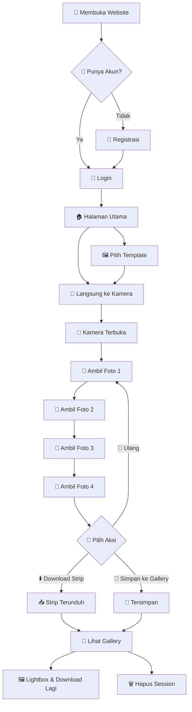
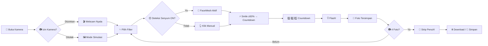

<h1 align="center">
  📸 Photobooth — Team's Uhuyyy Coperate
</h1>

<p align="center">
  <strong>Aplikasi Web Photobooth Gratis — Sage Maximalist Theme</strong>
  <br>
  Ambil foto, pilih template, unduh strip foto digital — semuanya di browser!
</p>

<p align="center">
  
  
  
  
  
</p>

---

## 🌿 Tentang Photobooth

**Photobooth** adalah aplikasi web photobooth gratis yang memungkinkan kamu mengambil 4 foto berurutan, menerapkan filter keren, memilih bingkai template, lalu mengunduhnya sebagai satu strip foto digital (PNG) — siap dibagikan ke media sosial atau dicetak!

Dibangun dengan tema **Sage Maximalist** — perpaduan warna putih bersih dengan aksen hijau sage, dekorasi ornamental yang elegan, dan nuansa botanical yang menenangkan.

> 🎯 **Target Pengguna:** Acara kumpul keluarga, pesta, gathering kantor, atau sekadar foto-foto seru bareng teman.

---

## 🧭 Alur Pengguna (User Flow)

Berikut adalah alur lengkap penggunaan aplikasi dari awal sampai akhir:



### Flow Detail — Halaman Kamera



---

## ✨ Fitur Unggulan

| Fitur | Keterangan |
|-------|-----------|
| 🎥 **Kamera Langsung** | Gunakan webcam langsung dari browser |
| 🖼️ **Mode Simulasi** | Tetap bisa foto walau kamera ditolak (4 gambar contoh) |
| 🎨 **4 Filter Gaya** | Normal, Retro BW, Warm Vintage, Neon Vibe |
| 😊 **Deteksi Senyum** | Tersenyum → otomatis jepret! (pakai AI FaceMesh) |
| ⏱️ **Countdown 3 Detik** | Waktu untuk siap-siap pose |
| 💡 **Flash Efek** | Efak kilat putih setiap jepretan |
| 🖼️ **8 Template Bingkai** | Classic, Polaroid, Vintage, Modern, Botanical, Double-Border, Cutie-Cat, Retro-Pop |
| 📥 **Download Strip PNG** | 4 foto dalam 1 gambar (400×1200px) |
| ☁️ **Simpan ke Akun** | Foto tersimpan di database, bisa diakses kapan saja |
| 💾 **Simpan Lokal** | Juga tersimpan di localStorage browser |
| 🖼️ **Gallery Lightbox** | Lihat foto ukuran penuh, navigasi keyboard |
| 🔐 **Akun & Login** | Register, login, reset password |
| 👑 **Panel Admin** | Kelola semua user & session |
| 📱 **Responsive** | Bisa dipakai di HP, tablet, dan desktop |

---

## 🖼️ 8 Template Bingkai

| Template | Gaya | Warna |
|----------|------|-------|
| **Classic** | Bersih, border sage | Putih + Hijau Sage |
| **Polaroid** | Bingkai tebal ala Polaroid | Putih + Bayangan Retro |
| **Vintage** | Nada krem, ornamental | Krem + Coklat Muda |
| **Modern** | Garis tipis, minimalis | Putih + Garis Hitam |
| **Botanical** | Daun-daun, aksen emas | Hijau Sage + Emas |
| **Double-Border** | Bingkai ganda studio lama | Sage Dua Lapis |
| **Cutie-Cat** | Pink, motif kucing | Pink + Aksesoris Kucing |
| **Retro-Pop** | Warna neon, vibrant | Neon + Warna Berani |

---

## 📚 Panduan Penggunaan Lengkap

### 🆕 Pertama Kali Pakai

#### 1. Buka Website
Buka aplikasi di browser. Kamu akan melihat halaman utama dengan desain maximalist.

#### 2. Registrasi Akun
Klik **Login** (pojok kanan atas) → pilih tab **"Daftar"** → isi:
- **Username** — nama panggilan
- **Email** — aktif untuk reset password
- **Password** — minimal 6 karakter

Atau langsung klik **"Mulai Berfoto"** — nanti akan diarahkan ke login.

#### 3. Login
Masukkan email & password yang sudah didaftarkan.

---

### 📸 Mengambil Foto

#### Langkah 1 — Pilih Template (Opsional)
- Klik menu **Templates** di navbar
- Pilih salah satu dari 8 gaya bingkai
- Otomatis diarahkan ke halaman kamera

#### Langkah 2 — Buka Halaman Kamera
Klik **Kamera** di navbar atau tombol **"Mulai Berfoto"** di halaman utama.

#### Langkah 3 — Pilih Filter
Sebelum jepret, kamu bisa memilih filter:
- **Normal** — warna asli
- **Retro BW** — hitam putih klasik
- **Warm Vintage** — nuansa sepia hangat
- **Neon Vibe** — warna vibrant ala neon

#### Langkah 4 — Atur Mode Capture
Ada 2 cara mengambil foto:

**A. Manual (klik sendiri)**
Klik tombol **📸 Capture** → hitung mundur 3 detik → flash → foto tersimpan.

**B. Otomatis (senyum)**
Aktifkan **"Deteksi Senyum"** → tersenyum lebar (≥50%) → otomatis jepret!

#### Langkah 5 — Ulangi 4 Kali
Setelah foto pertama, lanjut ke slot 2, 3, 4. Preview strip akan terlihat di samping kanan.

> 💡 **Tips:** Setelah 4 foto penuh, akan muncul notifikasi "Strip penuh!".

---

### ⬇️ Download Cetakan

Setelah 4 foto terkumpul:

1. Klik tombol **"Unduh Cetakan Foto"**
2. Browser akan mendownload file `photobooth-strip-xxx.png`
3. File berupa 4 foto dalam 1 strip vertikal (400×1200px)

---

### 💾 Simpan ke Gallery

Klik **"Simpan ke Gallery"** → foto tersimpan di:
- ☁️ **Server database** (via akun kamu)
- 💻 **LocalStorage browser** (cadangan offline)

---

### 🖼️ Melihat Gallery

Klik menu **Gallery** di navbar → kamu akan melihat semua sesi foto yang sudah disimpan.

Di setiap kartu:
- 👆 **Klik thumbnail** → lihat foto ukuran penuh (lightbox)
- ⬇️ **Unduh Strip** — download ulang
- 🗑️ **Hapus** — hapus session

---

### 👤 Mengelola Akun

Klik avatar (pojok kanan atas) → **Profil Saya**:
- **Edit Username** — ganti nama
- **Edit Bio** — tambah deskripsi
- **Upload Avatar** — foto profil
- **Logout** — keluar

#### Lupa Password?
Di halaman login, klik **"Lupa Password?"** → masukkan email → dapatkan link reset.

---

### 👑 Panel Admin (Khusus Admin)

> Login dengan `admin@photobooth.app` / `admin123`

Fitur:
- 📋 **Daftar Semua User** — lihat email, jumlah foto, tanggal daftar, login terakhir
- 🖼️ **Lihat Gallery User** — klik user untuk lihat foto-foto mereka
- 🗑️ **Hapus User** — hapus akun pengguna
- 🧹 **Cleanup Database** — hapus token kadaluarsa
- ⏰ **Hapus User Tidak Aktif** — filter 30/60/90/180/365 hari

> ℹ️ Admin **tidak bisa** mengakses halaman kamera.

---

## 🛠️ Tech Stack

| Layer | Teknologi |
|-------|-----------|
| **Frontend** | React 19, Vite 8, Tailwind CSS 3 |
| **Routing** | React Router 6 |
| **Backend** | Express 5 (ESM) |
| **Database** | SQLite (better-sqlite3) |
| **Auth** | bcryptjs + JWT (7 hari) |
| **Face Detection** | MediaPipe FaceMesh |
| **Linting** | ESLint 10 (flat config) |

### Design Tokens

```css
Sage Green Palette:
  sage-50:  #F8F9F6  /* Background */
  sage-200: #DDE2D8  /* Borders */
  sage-500: #9CAF88  /* Brand primary */
  sage-800: #2D3A2D  /* Text headings */

Font: Poppins (sans), JetBrains Mono (mono), Playfair Display (decorative)
```

---

## 🚀 Cara Install & Jalankan

### Prasyarat
- Node.js ≥ 18
- npm ≥ 9

### Langkah-langkah

```bash
# 1. Clone repository
git clone https://github.com/OrganicoconutSugar/Photobooth-Uhuyyy.git
cd Photobooth-Uhuyyy

# 2. Install semua dependencies
npm install

# 3. Build frontend
npm run build

# 4. Jalankan development mode (Vite + Express)
npm run dev
```

Akses di **http://localhost:5173** 🎉

### Script Lainnya

| Perintah | Fungsi |
|----------|--------|
| `npm run dev` | Jalankan Vite + Express bersamaan |
| `npm run dev:vite` | Vite dev server saja |
| `npm run dev:server` | Express server saja |
| `npm run build` | Build frontend ke `dist/` |
| `npm start` | Jalankan Express server (production) |
| `npm run preview` | Preview hasil build |
| `npm run lint` | Cek kode dengan ESLint |

---

## 🌐 API Endpoints

### Auth

| Method | Endpoint | Auth | Fungsi |
|--------|----------|------|--------|
| POST | `/api/auth/register` | ❌ | Daftar akun baru |
| POST | `/api/auth/login` | ❌ | Login |
| GET | `/api/auth/me` | ✅ | Ambil data user saat ini |
| PUT | `/api/auth/profile` | ✅ | Update profil |
| POST | `/api/auth/forgot-password` | ❌ | Minta reset password |
| POST | `/api/auth/reset-password` | ❌ | Reset password |

### Sessions

| Method | Endpoint | Auth | Fungsi |
|--------|----------|------|--------|
| GET | `/api/sessions` | ✅ | Ambil semua session user |
| POST | `/api/sessions` | ✅ | Simpan session baru |
| DELETE | `/api/sessions/:id` | ✅ | Hapus session |

### Admin

| Method | Endpoint | Auth | Fungsi |
|--------|----------|------|--------|
| GET | `/api/admin/users` | ✅ Admin | Daftar semua user |
| GET | `/api/admin/users/:id/sessions` | ✅ Admin | Lihat session user |
| DELETE | `/api/admin/users/:id` | ✅ Admin | Hapus user |
| DELETE | `/api/admin/users/inactive/:days` | ✅ Admin | Hapus user tidak aktif |
| POST | `/api/admin/cleanup` | ✅ Admin | Bersihkan database |

---

## 🗺️ Routing Aplikasi

| URL | Halaman | Akses |
|-----|---------|-------|
| `/` | Beranda (Landing Page) | Semua orang |
| `/kamera` | Kamera / Capture | Login required |
| `/kamera?template=id` | Kamera dengan template | Login required |
| `/gallery` | Gallery Foto | Login required |
| `/templates` | Pilih Template | Login required |
| `/login` | Login / Daftar / Lupa Password | Semua orang |
| `/account` | Profil Saya | Login required |
| `/admin` | Panel Admin | Admin only |

---

## 📦 Struktur Folder

```
photobooth-app/
├── server/               # Backend Express
│   ├── index.js          # Entry point (port 3001)
│   ├── db.js             # Database SQLite
│   ├── auth.js           # Auth endpoints
│   ├── sessions.js       # Session CRUD
│   ├── admin.js          # Admin endpoints
│   └── seed.js           # Seed admin user
├── src/                  # Frontend React
│   ├── App.jsx           # Root component + Routes
│   ├── main.jsx          # Entry point
│   ├── index.css         # Global styles + Tailwind
│   ├── context/          # AuthContext (state management)
│   ├── components/       # Sidebar, AccountMenu, dll
│   ├── pages/            # Beranda, Kamera, Gallery, dll
│   ├── lib/              # API helper, frame styles, gallery store
│   └── assets/           # Icons, images
├── index.html            # Entry HTML
├── vite.config.js        # Vite config
├── tailwind.config.js    # Tailwind config
└── package.json          # Dependencies
```

---

## 🖼️ Screenshot

> 📸 *Tambahkan screenshot aplikasi di sini — misalnya tampilan halaman utama, kamera, gallery, dan template.*

| Halaman | Preview |
|---------|---------|
| Beranda | `[Screenshot Beranda]` |
| Kamera | `[Screenshot Kamera]` |
| Gallery | `[Screenshot Gallery]` |
| Templates | `[Screenshot Templates]` |
| Login | `[Screenshot Login]` |

---

## 🤝 Kontribusi

Proyek ini dikembangkan oleh **Team's Uhuyyy Coperate**. Jika kamu ingin berkontribusi:

1. Fork repository
2. Buat branch baru (`git checkout -b fitur-keren`)
3. Commit perubahan (`git commit -m 'Tambah fitur keren'`)
4. Push ke branch (`git push origin fitur-keren`)
5. Buka Pull Request

---

## 📄 Lisensi

© 2026 Team's Uhuyyy Coperate. Aplikasi gratis untuk penggunaan pribadi dan acara.

---

<p align="center">
  Dibuat dengan ❤️ menggunakan React, Express, SQLite & Tailwind CSS
  <br>
  <strong>Team's Uhuyyy Coperate</strong>
</p>
